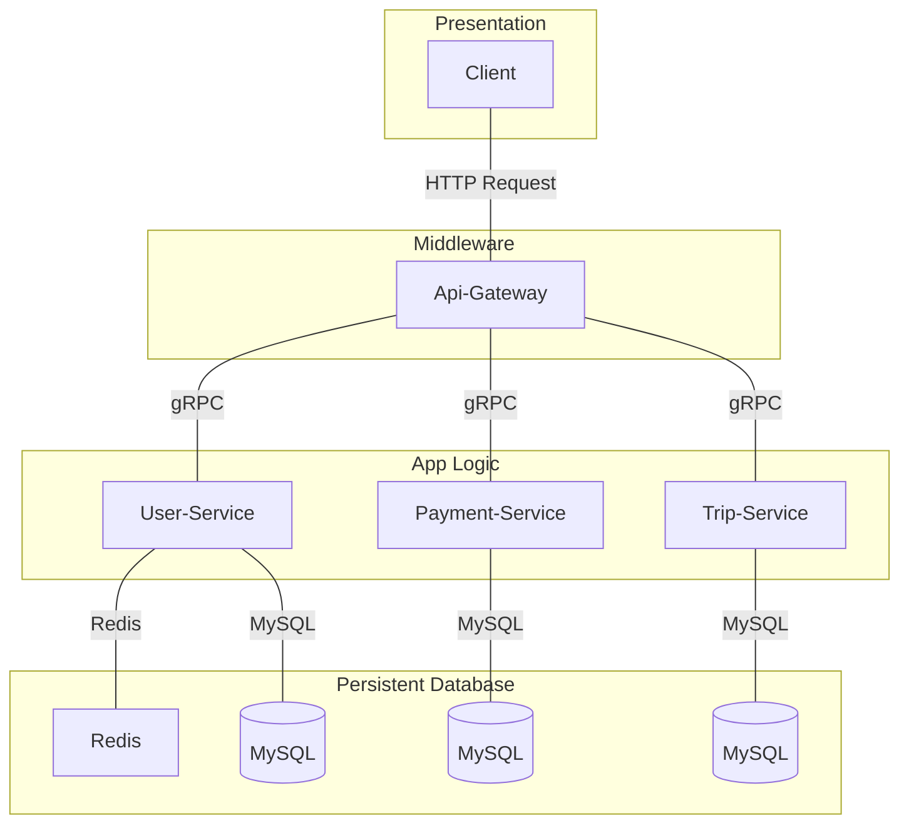

# EcoTaxi API Gateway

EcoTaxi API Gateway serves as a middleware that handles requests from the frontend and routes them to the corresponding backend services. The API Gateway uses [gRPC](https://grpc.io/docs/languages/go/quickstart/) to communicate with other services, such as the `user-service`, `trip-service` and `payment-service`. The API Gateway itself accepts HTTP requests, serves as gRPC client for every backend service and forwards them to the appropriate services.

## Git Repositories

This project is part of the EcoTaxi ecosystem, which includes multiple repositories for the frontend, backend services, and API gateway:

- **Frontend**: [EcoTaxi Frontend](https://github.com/haiyen11231/eco-taxi-frontend.git)
- **API Gateway**: [EcoTaxi API Gateway](https://github.com/haiyen11231/eco-taxi-api-gateway.git)
- **User Service**: [EcoTaxi User Service](https://github.com/haiyen11231/eco-taxi-backend-user-service.git)
- **Payment Service**: [EcoTaxi Payment Service](https://github.com/AWYS7/eco-taxi-payment-service.git)
- **Trip Service**: [EcoTaxi Trip Service](https://github.com/lukea11/eco-taxi-backend-trip-service.git)

## Directory Structure

```plaintext
eco-taxi-api-gateway/
│
├── cmd/
│   └── api_gateway/
│       └── main.go
│
├── internal/
│   ├── grpc/
│   │   ├── pb/
│   │   |   ├── payment_service_grpc.pb.go
│   │   |   ├── payment_service.pb.go
│   │   |   ├── trip_service_grpc.pb.go
│   │   |   ├── trip_service.pb.go
│   │   |   ├── user_service_grpc.pb.go
│   │   |   └── user_service.pb.go
│   │   |
│   │   ├── payment_service.proto
│   │   ├── trip_service.proto
│   │   └── user_service.proto
│   │
│   ├── handler/
│   │   ├── payment_service_handler.go
│   │   ├── trip_service_handler.go
│   │   └── user_service_handler.go
│   │
│   ├── middleware/
│   │   └── auth_user.go
│   │
│   ├── model/
│   │   ├── payment_service.go
│   │   ├── trip_service.go
│   │   └── user_service.go
│   │
│   └── utils/
│       ├── grpc_client.go
│       └── response.go
│
├── .gitignore
├── app.env
├── docker-compose.yml
├── Dockerfile
├── go.mod
├── go.sum
├── Makefile
└── README.md
```

## Prerequisites

Before you begin, ensure that you have the following installed:

- **Go**
- **gRPC Tools** (Protocol Buffers and gRPC Go)
- **Make**
- **Docker** (optional, for containerization)

## Installation

1. Clone the repository:

   ```bash
   git clone https://github.com/haiyen11231/eco-taxi-api-gateway.git
   cd eco-taxi-api-gateway
   ```

2. Create the app.env file:

Create a `app.env` file in the root directory of the project. This file should contain the environment variables required for the application to run. Here's a sample `app.env` file:

```env
GRPC_USER_HOST=user_host
GRPC_TRIP_HOST=trip_host
GRPC_PAYMENT_HOST=payment_host
PORT=port
```

Update the values with your own configuration:

- **`GRPC_USER_HOST`**: Specify the address of the gRPC User service (e.g., localhost:5002).
- **`GRPC_TRIP_HOST`**: Specify the address of the gRPC Trip service (e.g., localhost:5003).
- **`GRPC_PAYMENT_HOST`**: Specify the address of the gRPC Payment service (e.g., localhost:5004).
- **`PORT`**: Define the port number on which the API Gateway will listen (e.g., 8081).

3. Install dependencies:

   ```bash
   go mod tidy
   ```

4. Start the development server:

   ```bash
   make run
   ```

## Postman Collection

[](https://web.postman.co/workspace/Eco-Taxi-Project~f9485719-23fa-4af6-b313-a8d852ab1233/overview)

## System Architecture Diagram


