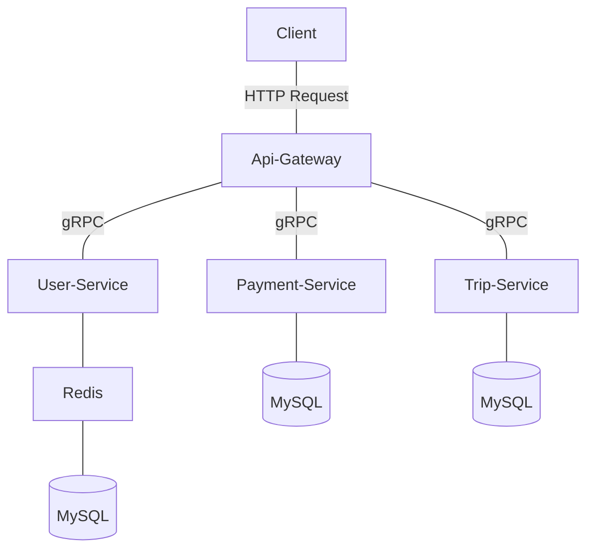

# EcoTaxi - API Gateway

This is a API Gateway of EcoTaxi Project using [gRPC](https://grpc.io/docs/languages/go/quickstart/) to communicate with other services: `user-service`, `trip-service` and `payment-service` built with [gin](https://github.com/gin-gonic/gin) and [gorm](https://gorm.io/). Each service has its own database connector, and the services are accessed via `api-gateway` that accepts HTTP requests.

## Postman Collection

[](https://app.getpostman.com/run-collection/23338632-45d13d1b-e210-44a9-8fbb-dbb16aac0293?action=collection%2Ffork&collection-url=entityId%3D23338632-45d13d1b-e210-44a9-8fbb-dbb16aac0293%26entityType%3Dcollection%26workspaceId%3D375a5178-dc50-49c8-9ed3-5295f7908d43#?env%5Bgo-gin-microservices-grpc%5D=W3sia2V5IjoidXJsIiwidmFsdWUiOiJodHRwOi8vbG9jYWxob3N0OjgwODEvIiwiZW5hYmxlZCI6dHJ1ZSwidHlwZSI6ImRlZmF1bHQiLCJzZXNzaW9uVmFsdWUiOiJodHRwOi8vbG9jYWxob3N0OjgwODEvIiwic2Vzc2lvbkluZGV4IjowfSx7ImtleSI6InRva2VuIiwidmFsdWUiOiJleUpoYkdjaU9pSklVekkxTmlJc0luUjVjQ0k2SWtwWFZDSjkuZXlKMWMyVnlYMmxrSWpveExDSmhkV1FpT2xzaVoyOHRaMmx1TFcxcFkzSnZjMlZ5ZG1salpTMW5jbkJqSWwwc0ltVjRjQ0k2TVRZNE1qa3lNamt3TVN3aWFXRjBJam94TmpneU56VXdNVEF4ZlEuTFJYYmVDeVdBdWtLTHZyTmgtcjFVX1BDajlmSVNaT1A3WDU2bkFHUG43RSIsImVuYWJsZWQiOnRydWUsInR5cGUiOiJzZWNyZXQiLCJzZXNzaW9uVmFsdWUiOiJleUpoYkdjaU9pSklVekkxTmlJc0luUjVjQ0k2SWtwWFZDSjkuZXlKMWMyVnlYMmxrSWpveExDSmhkV1FpT2xzaVoyOHRaMmx1TFcxcFkzSnZjMlZ5ZG1salpTMW5jbkJqSWwwc0ltVjRjQ0k2TVRZNE1qa3lNamt3TVN3aWFXRjBJam94TmpneS4uLiIsInNlc3Npb25JbmRleCI6MX1d)

## Building and Running the Services

To build and run the services, follow these steps:

1.  Clone this repository.
2.  Navigate to the `eco-taxi-api-gateway` directory.
<!-- 3.  Run `make up_build` to build the Docker images for the services.
3.  Server will be running at http://localhost:8081/ -->

Once the services are running, you can test them with Postman by sending HTTP requests to the gateway service.

## Directory Structure

The directory structure for the services is as follows:

```plaintext
eco-taxi-api-gateway/
│
├── cmd/
│   └── api_gateway/
│       └── main.go
│
├── internal/
│   ├── grpc/
│   │   ├── pb/
│   │   |   ├── payment_service_grpc.pb.go
│   │   |   ├── payment_service.pb.go
│   │   |   ├── trip_service_grpc.pb.go
│   │   |   ├── trip_service.pb.go
│   │   |   ├── user_service_grpc.pb.go
│   │   |   └── user_service.pb.go
│   │   |
│   │   ├── payment_service.proto
│   │   ├── trip_service.proto
│   │   └── user_service.proto
│   │
│   ├── handler/
│   │   ├── payment_service_handler.go
│   │   ├── trip_service_handler.go
│   │   └── user_service_handler.go
│   │
│   ├── middleware/
│   │   └── auth_user.go
│   │
│   ├── model/
│   │   ├── payment_service.go
│   │   ├── trip_service.go
│   │   └── user_service.go
│   │
│   └── utils/
│       ├── grpc_client.go
│       └── response.go
│
├── app.env
├── docker-compose.yml
├── Dockerfile
├── go.mod
├── go.sum
├── Makefile
└── README.md
```

## System Architecture Diagram


